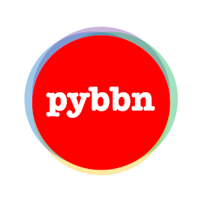

.. meta::
   :description: An exact probabilistic and causal inference API using Bayesian Belief Networks (BBNs).
   :keywords: python, statistics, causal, causality, probabilistic, exact inference, bayesian, bayesian belief networks, logic sampling, sampling, graph, synthetic data, causal inference
   :robots: index, follow
   :abstract: Exact probabilistic inference is accomplished using the Junction Tree Algorithm. Causal inference is accomplished using the average causal effect (ACE). Simulation features for generating synthetic data is also available. Feature to generate synthetic BBNs is also built in. Comes with batteries for experimentation and production-ready use.
   :author: Jee Vang, Ph.D.
   :contact: vangjee@gmail.com
   :copyright: Jee Vang, Ph.D.
   :content: global
   :generator: Sphinx
   :language: English
   :rating: general
   :reply-to: vangjee@gmail.com
   :web_author: Jee Vang, Ph.D.
   :revisit-after: 1 days

.. PyBBN documentation master file, created by
   sphinx-quickstart on Tue Jan 17 17:44:12 2017.
   You can adapt this file completely to your liking, but it should at least
   contain the root `toctree` directive.

py-bbn
======

End of Life: This version of py-bbn is no longer maintained. For a new version please go `here <https://pybbn.rocketvector.io>`_.

``py-bbn`` is a Python implementation of probabilistic and causal inference in Bayesian Belief Networks using exact inference algorithms :cite:`1988:cowell,1997:castillo,1999:huang,2009:koller,2012:murphy`.

You may install ``py-bbn`` from `pypi <https://pypi.org/project/pybbn/>`_.

.. code:: bash

    pip install pybbn

If you like py-bbn, you might be interested in our next-generation products.

`Rocket Vector <https://rocketvector.io>`_ is a CausalAI platform in the cloud.

.. image:: https://rocketvector.io/assets/img/logo/rocketvector-150x150.png
   :align: center
   :alt: Rocket Vector logo.

`Autonosis <https://autonosis.io/>`_ is a GenAI + CausalAI capable platform.

.. image:: https://autonosis.io/assets/img/android-chrome-150x-150.png
   :align: center
   :alt: Autonosis logo.

`pyspark-bbn <https://sdk.rocketvector.io/>`_ is a is a scalable, massively parallel processing MPP framework for learning structures and parameters of Bayesian Belief Networks BBNs using `Apache Spark <https://spark.apache.org/>`_.

.. image:: https://sdk.rocketvector.io/_images/pyspark-bbn-150x150.png
   :align: center
   :alt: pyspark-bbn logo.

Please contact us at info@rocketvector.io. Let's reach for success!

.. toctree::
   :maxdepth: 2
   :caption: Contents

   probabilistic-inference
   gaussian-inference
   causal-inference
   serde
   generate
   sampling
   structure-data
   exact-inference-widgets
   gaussian-inference-widgets
   zzz-bib

.. toctree::
   :maxdepth: 1
   :caption: Gotcha's

   edge-ordering

.. toctree::
   :maxdepth: 2
   :caption: API Documentation

   modules

Indices and tables
==================

* :ref:`genindex`
* :ref:`modindex`
* :ref:`search`

Copyright
=========

Software
--------

::

    Copyright 2017 Jee Vang

    Licensed under the Apache License, Version 2.0 (the "License");
    you may not use this file except in compliance with the License.
    You may obtain a copy of the License at

       http://www.apache.org/licenses/LICENSE-2.0

    Unless required by applicable law or agreed to in writing, software
    distributed under the License is distributed on an "AS IS" BASIS,
    WITHOUT WARRANTIES OR CONDITIONS OF ANY KIND, either express or implied.
    See the License for the specific language governing permissions and
    limitations under the License.

Art
---

::

   Copyright 2020 Daytchia Vang

Citation
========

::

    @misc{vang_2017,
    title={PyBBN},
    url={https://github.com/vangj/py-bbn/},
    author={Vang, Jee},
    year={2017},
    month={Jan}}

Author
======

Jee Vang, Ph.D.

- |Patreon_Link|
- |Github_Link|

.. |Patreon_Link| raw:: html

   <a href="https://www.patreon.com/vangj" target="_blank">Patreon</a>: support is appreciated

.. |Github_Link| raw:: html

   <a href="https://github.com/sponsors/vangj" target="_blank">GitHub</a>: sponsorship will help us change the world for the better

Help
====

- |Source_Link|
- |Gitter_Link|

.. |Source_Link| raw:: html

   <a href="https://github.com/oneoffcoder/py-bbn" target="_blank">GitHub</a>: source code

.. |Gitter_Link| raw:: html

   <a href="https://gitter.im/dataflava/py-bbn" target="_blank">Gitter</a>: chat